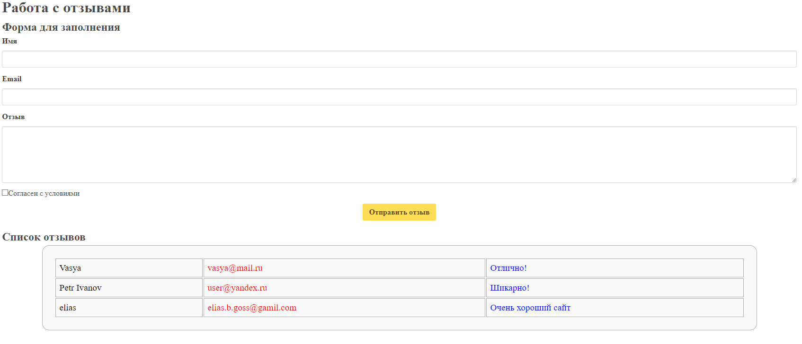
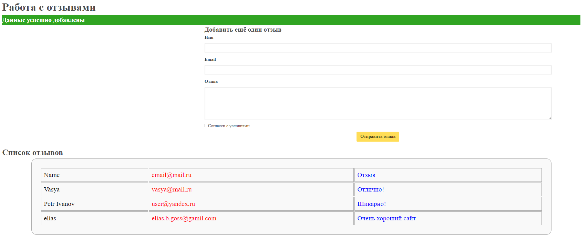

## Создание приложения «Книга отзывов» с использованием БД MySQL.

### Код приложения (index.php):

```php
<meta charset="utf-8">
<h1>Работа с логом</h1>
<?php
  $f = '<h2>Форма для заполнения</h2>';
  if ($_SERVER['REQUEST_METHOD']==='POST') {
    $r = htmlentities($_POST['message']) ?? 'Пустое сообщение';

    $f = fopen('log.txt', 'a');
    fwrite($f, $r);
    fwrite($f, "\n");
    fclose($f);

    $f = '<style>.right {width: 60%; margin-left: 35%; zoom: 80%}</style>';
    $f .= '<div class="right><h2>Добавить ещё один отзыв</h2></div>';
    echo '<h3 style="color:green">Данные успешно добавлены</h3>';
  }
  echo $f;
  echo "<div class=\"right\">";
  echo "<form method=\"post\">";
  echo <<<_END
      <div>
        <label>Сообщение</label>
        <input id="message" name="message" required="required" type="text">
        <button type="submit">Отправить сообщение</button>
      </div>
_END;
  echo "</form></div>";
  echo "<h2>Список отзывов</h2>\n";
  echo require_once('list.php');
?>
```

### Код, отвечающий за подключение к базе данных (bd.php):

```php
<?php
    $dbloc = 'localhost';
    $dbuser = $dbname = 'user1';
    $dbpass = 'Qwerty123';
    $dsn = $dsn = "mysql:host={$dbloc};dbname={$dbname}";
    return new PDO($dsn, $dbuser, $dbpass);
?>
```

### Код формы, собирающей данные (form.php):

```php
<?php
return <<<_END
        <div class="field">
            <label class="label">Имя</label>
            <div class="control">
                <input class="input" id="name" name="name" required="required" type="text">
            </div>
        </div>
        <div class="field">
            <label class="label">Email</label>
            <div class="control">
                <input class="input" id="email" name="email" required="required" type="email">
            </div>
        </div>
        <div class="field">
            <label class="label">Отзыв</label>
            <div class="control">
                <textarea class="textarea" id="text" name="text" required="required"></textarea>
            </div>
        </div>
        <div class="field">
            <div class="control">
                <label class="checkbox"><input required="required" type="checkbox">Согласен с условиями</label>
            </div>
        </div>
        <div class="field">
            <div class="control has-text-centered">
                <button class="button is-warning has-text-weight-bold" type="submit">Отправить отзыв</button>
            </div>
        </div>
_END;
?>
```

### Код, отвечающий за вывод данных в виде таблицы (table.php):

```php
<?php
    $sql = "SELECT `name`, `email`, `text` FROM `reviews` ORDER BY `id` DESC";
    $result  = $conn -> query($sql);
    $list = '';
    $list .= '<table>';
    while ($row = $result->fetch(PDO::FETCH_NUM)) {
        $list .= '<tr>'.implode('',array_map(function($x){ return '<td>'.$x.'</td>';},$row)).'</tr>';
    }
    $list .= '/<table>';
    return $list;
?>
```

### Код, отвечающий за извлечение данных (get.php):

```php
<?php
    error_reporting(E_ALL);
    ini_set('display_errors', 1);
    header('Content-type: text/html; charset=utf-8');
    echo "<h1>Извлечение данных</h1>";
    $conn = require_once ('bd.php');

    $q = 'MAX(`id`)';

    $sql = "SELECT {$q} FROM `reviews`;";
    $result = $conn -> query($sql) -> fetch(PDO::FETCH_OBJ);

    $id = $_GET['id'] ?? $result -> $q;

    $sql = "SELECT `text` FROM `reviews` WHERE `id`='{$id}'";
    $result = $conn -> query($sql) -> fetch(PDO::FETCH_OBJ);
    echo ($result->text);
?>
```

### Код, отвечающий за обновление данных (update.php):

```php
<?php
    error_reporting(E_ALL);
    ini_set('display_errors', 1);
    header('Content-type: text/html; charset=utf-8');
    echo "<h1>Обновление данных</h1>";
    $conn = require_once ('bd.php');
    $id = $_GET['id'];
    $name = $_GET['name'];
    $email = $_GET['email'];
    $text = $_GET['text'];

    $sql = "SELECT MAX(id) AS `maxid` FROM `reviews`";
    $maxix = $conn -> query($sql) -> fetch(PDO::FETCH_OBJ) -> maxid;
    if ($id < $maxix)
    {
        $sql = "UPDATE `reviews` SET `name`='{$name}', `email`='{$email}', `text`='{$text}' WHERE `id`='{$id}';";
        $conn -> query($sql);
        echo ("Обновлено");
    }
    else{
        echo ("Не обновлено");
    }
?>
```

### Код, отвечающий за удаление данных (delete.php):

```php
<?php
    error_reporting(E_ALL);
    ini_set('display_errors', 1);
    header('Content-type: text/html; charset=utf-8');
    echo "<h1>Удаление данных</h1>";
    $conn = require_once ('bd.php');
    $id = $_GET['id'];

    $sql = "SELECT MAX(id) AS `maxid` FROM `reviews`";
    $maxix = $conn -> query($sql) -> fetch(PDO::FETCH_OBJ) -> maxid;
    if ($id < $maxix)
    {
        $sql = "DELETE FROM `reviews` WHERE `id`='{$id}'";
        $conn -> query($sql);
        echo ("Удалено");
    }
    else{
        echo ("Не удалено");
    }
?>
```

### Результаты выполнения работы:





## Вывод:

В ходе выполнения лабораторной работы были получены навыки работы с языком программирования php и СУБД MySQL.

Было создано приложение «Книга отзывов» с использованием БД MySQL.
